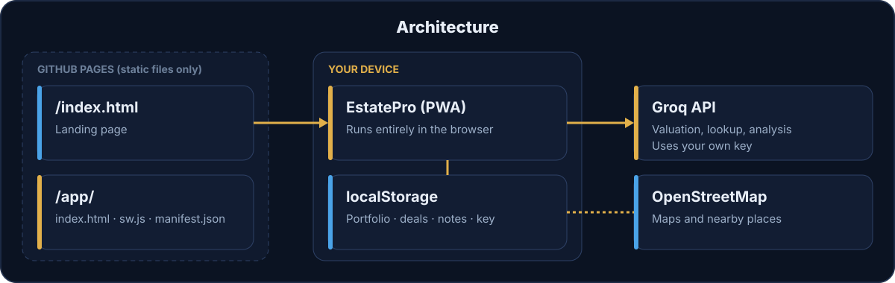

<p align="center"></p>

# EstatePro

A free AI real estate toolkit for investors. Value a property, run the deal math and track your portfolio, all in one app that installs on your phone. Your data stays on your device.

## What it is

- **Value**: enter an address or paste a listing and get an estimate, range, comparable sales and a verdict against the asking price.
- **Analyze**: mortgage, rental ROI, cash flow and cap rate, plus a side-by-side compare for up to three properties.
- **Track**: portfolio with expenses and reports, and a deal pipeline from watching to closed.
- **Location and market**: map, nearby places and market snapshots.

Valuations are AI estimates, not appraisals. Verify with MLS or your county property appraiser before you act.


## Live URLs

- Landing page: https://johnlaz.github.io/estatepro/
- App: https://johnlaz.github.io/estatepro/app/

## Repo layout

```
/index.html          landing page
/README.md
/docs/               README graphics (SVG)
/app/index.html      the app (single file)
/app/manifest.json   PWA manifest
/app/sw.js           service worker
/app/icon-192.png    app icon
/app/icon-512.png    app icon
/app/shot-*.png      store screenshots (currently simulated, demo data)
```



## AI and model setup

EstatePro uses [Groq](https://console.groq.com) with your own free API key.

1. Create a key at console.groq.com.
2. Open **Settings** in the app and paste it in. The model list refreshes automatically when you save a new key.
3. Tap **Refresh models** any time to pull Groq's current chat models into the picker.

Your saved model and the three built-in choices are never replaced. If Groq retires a model you picked, the app keeps it and flags it so you can choose another.

## Data and privacy

- Portfolio, deals, notes, history and your API key live in your browser's local storage (key `lazestate_v1`, kept from earlier versions so nothing is lost).
- The only data that leaves your device is the property description you submit, sent to Groq with your key, plus map lookups to OpenStreetMap.
- Use **Settings → Export** to back up or move your data. Clearing site data erases it.

## Deploy and update

Static files only, served by GitHub Pages from the repo root.

1. Commit the files to `main` of the `estatepro` repo.
2. Pages → Deploy from branch → `main` / root.
3. To ship a change, bump `VERSION` in `app/sw.js` **and** `APP_VERSION` in `app/index.html` so the visible version stamp and the cache name match.
4. Installed apps show an **Update ready — Reload** bar the next time they open online.

## Changelog

### 4.0.0
- Fixed a script error that stopped every button in the previous build.
- Renamed to EstatePro with a new icon and navy and gold design.
- Mobile tab bar with Tools and More sheets; valuation form trimmed with optional detail folded away.
- Groq model list refresh on key save and a Refresh button; saved models are never swapped.
- Service worker rewritten: network-first pages, update prompt, versioned cache.
- Flattened repo: removed duplicate icons and unused files; manifest has 192 and 512 icons plus screenshots.
- Version stamp, accessibility labels, larger tap targets, honest estimate notice.

---

© 2026 LAZLAB Creations. All Rights Reserved. · lazlab.io@gmail.com
